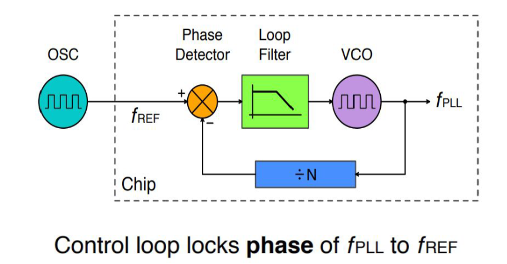
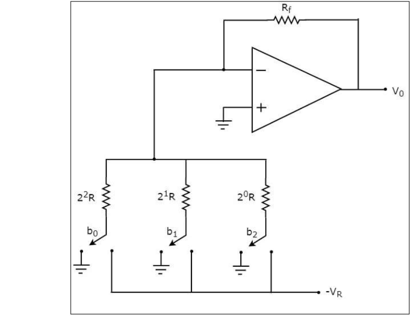

# Week 2 – BabySoC Fundamentals & Functional Modelling

## 🧠 What is a System-on-Chip (SoC)?
A System-on-Chip (SoC) integrates **CPU, memory, I/O ports, GPU, DSPs,Power management circuitry, other special features such as Wi-Fi, Bluetooth and other logic blocks** on a single silicon die.  
The goal is high performance with low power and reduced area compared to board-level integration.

## ⚙️ Key Components of an SoC
- **CPU (Core Processor):** Executes instructions and controls data flow.  
- **Memory:** Includes SRAM, ROM, and cache; stores data/instructions.  
- **Peripherals:** Timers, UART, SPI, GPIO, etc., providing external interfaces.  
- **Interconnect (Bus Fabric):** Links CPU, memory, and peripherals.  
- **Clock & Reset Networks:** Synchronize and initialize system operation.

## Challenges with SoCs
- ** Complex Design **
- ** Heating Issues **
- ** Less Flexibility

## 🧩 Types of SoCs

### 1. Microcontroller-based SoC
Built around a microcontroller for simple control operations.  
They are **low-power**, **cost-effective**, and ideal for **embedded and IoT** applications such as home appliances, automotive systems, and other devices with minimal processing needs.

### 2. Microprocessor-based SoC
Contains a microprocessor capable of **multitasking** and running **operating systems**.  
Commonly found in **smartphones**, **tablets**, and **consumer electronics**, these SoCs handle **complex, data-intensive, and interactive applications**.

### 3. Application-Specific SoC (ASIC-based)
Custom-designed for **specialized high-performance tasks** like graphics, AI, and networking.  
They are **optimized for speed and efficiency** and are typically used in **GPUs**, **AI accelerators**, and **industrial or financial systems** requiring precise and fast computation.

## 🧩 Why BabySoC as a Learning Model

## 🧩 Introduction
**VSDBabySoC** is a compact yet powerful System-on-Chip (SoC) based on the open-source **RISC-V architecture**.  
Its primary goal is to enable the **simultaneous testing of three open-source IP cores** and the **calibration of analog components** within a single integrated environment.  

VSDBabySoC includes:
- **RVMYTH Microprocessor** – A simple RISC-V core for data processing. (RVMYTH:- RISC-V Microprocessor for You in Thirty Hours) 
- **8× Phase-Locked Loop (PLL)** – For stable clock generation  
- **10-bit Digital-to-Analog Converter (DAC)** – For analog signal interfacing  

---

## ⚙️ Functional Flow

### 🟢 Initialization and Clock Generation
When the SoC receives its initial input, the **PLL** is activated.  
The PLL generates a **stable and synchronized clock signal**, ensuring that:
- All modules (CPU and DAC) operate in perfect timing.
- Clock mismatches are eliminated, maintaining signal integrity.  

This synchronization enables reliable communication between RVMYTH and DAC.

---

### 🧠 Data Processing in RVMYTH
The **RVMYTH microprocessor** serves as the computational core of BabySoC.  
It performs instruction execution and data manipulation.  

- The **`r17` register** is used to hold sequential values destined for conversion.  
- During execution, RVMYTH continually updates `r17` with new digital data.  
- This cyclical update enables a **continuous data stream** for the DAC to process.  

---

### 🔊 Analog Signal Generation via DAC
The **10-bit DAC** receives processed digital data from RVMYTH and converts it into analog signals.  
The output waveform is saved in a file named `OUT`, which can be used to drive analog devices such as:
- TVs  
- Mobile phones  
- Audio amplifiers  

This demonstrates how **digital computations can generate real-world analog signals**, bridging the gap between computation and perception.

---

## 🧱 Components of VSDBabySoC

### 🧩 RVMYTH (RISC-V CPU)
- Acts as the **central processing unit** of BabySoC.  
- Based on the open-source RISC-V ISA.  
- Simple, modifiable, and ideal for **learning CPU architecture and SoC integration**.  
- Manages data flow and interfaces with the DAC for signal output.

---

### ⏱ Phase-Locked Loop (PLL)
A **Phase-Locked Loop** is a feedback control system that aligns its output phase and frequency with a reference input.

**Core Components:**
- **Phase Detector:** Compares the phase of input and output signals, generating an error signal.  
- **Loop Filter:** Smooths the error signal to produce a steady control voltage.  
- **Voltage-Controlled Oscillator (VCO):** Adjusts output frequency according to control voltage.

**Functionality:**
- Maintains constant phase difference between input and output.  
- May include a frequency divider to generate multiples of the reference frequency.

**Why On-Chip PLL Instead of Off-Chip Clock?**
- **Clock Distribution Delays:** Long interconnects cause timing mismatches.  
- **Clock Jitter:** External sources introduce instability.  
- **Multiple Frequency Needs:** Different blocks may need separate frequencies (e.g., CPU vs DAC).  
- **Crystal Tolerance & Stability:** Off-chip crystals vary with temperature and aging, affecting timing precision.

Thus, the on-chip PLL ensures **tight timing control and stability** across all SoC modules.

---

### 🎚 Digital-to-Analog Converter (DAC)
A **Digital-to-Analog Converter** transforms binary data into analog voltage or current.

**Basic Working:**
- Takes digital input bits (e.g., 10 bits → 1024 discrete levels).  
- Produces a proportional analog output voltage.

**Common DAC Architectures:**
1. **Weighted Resistor DAC:** Uses resistors of different values to scale bit significance.
 
 
2. **R-2R Ladder DAC:** Uses a repeating resistor network for simplified and scalable design.
  

**In VSDBabySoC:**
- The **10-bit DAC** converts RVMYTH’s digital output to analog form.  
- The analog waveform can be observed using **GTKWave** or sent to real devices for functional demonstration.

---

## 🧾 Summary
- **VSDBabySoC** is a minimal yet complete SoC platform built around **RVMYTH (RISC-V)**, **PLL**, and **DAC**.  
- Demonstrates the interaction between **digital (CPU)** and **analog (DAC)** domains.  
- Functional modelling validates SoC behaviour before RTL and layout design.  
- Provides a practical example of **clock synchronization**, **data processing**, and **digital-to-analog interfacing** within a single SoC.  

> **References:**
> - [VSDBabySoC GitHub Repository](https://github.com/hemanthkumardm/SFAL-VSD-SoCJourney/tree/main/11.%20Fundamentals%20of%20SoC%20Design)

## 🧪 Role of Functional Modelling
Functional modelling comes **before RTL and physical design** to:
- Validate system-level architecture and data flow.
- Check correctness of control logic and inter-module communication.
- Provide a platform for testbench development and early verification.
- Enable simulation in Icarus Verilog and visual waveform analysis in GTKWave.

